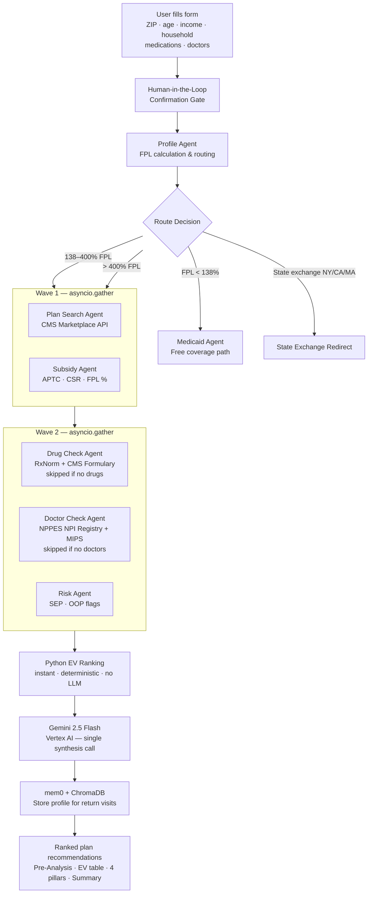
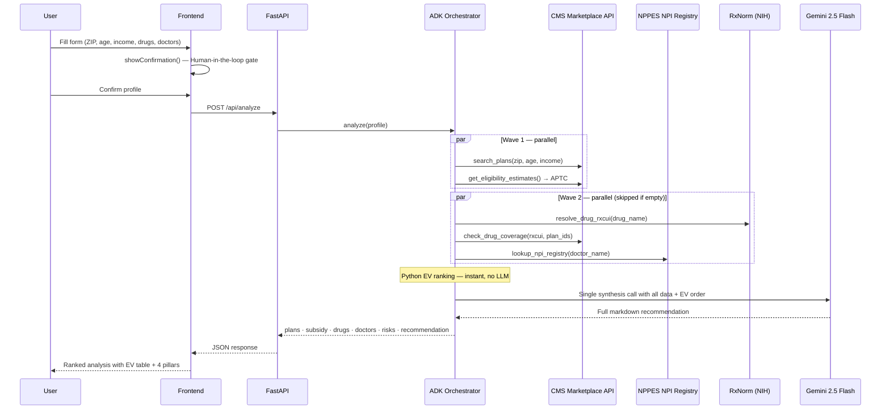

# CoverWise — AI Health Insurance Advisor

An agentic AI system that helps Americans find their optimal ACA health insurance plan by
analyzing income, medications, and doctors against live government data — personalized,
unbiased, and free.

**Live URL:** https://coverwise-65446133790.us-central1.run.app  
**Branch:** `adk-insurance-advisor-release`

---

## The Problem

**Health insurance is the highest-stakes financial decision most Americans make every year,
and almost no one makes it well.**

- The average American overspends **$1,500–$2,500/year** by choosing the wrong plan for
  their actual utilization and medications (Kaiser Family Foundation, 2023).
- Healthcare.gov shows 50–90 plans per ZIP code. None tell you your true cost after your
  medications, doctors, and utilization are factored in.
- Navigating this requires cross-referencing 5+ government websites most people don't know
  exist: CMS Marketplace, NPPES NPI Registry, each insurer's formulary, HRSA shortage
  databases, IRS APTC tables.

**What people do today:** Click the lowest premium, or call a broker who earns a commission
from the insurer — a direct conflict of interest. Neither accounts for drug tier costs,
prior authorization requirements, or out-of-pocket max exposure.

---

## The User

**Primary:** The 21.4 million Americans buying ACA Marketplace insurance without an employer
HR department — freelancers, gig workers (Uber, DoorDash, Upwork), self-employed, between jobs.

**Secondary:** The 160 million with employer coverage facing annual open enrollment blind.

**Persona — Maria, 34, Chicago graphic designer:**
Earns $52,000 freelancing. Takes Ozempic and Metformin. Sees her endocrinologist quarterly.
Every November she spends 4–6 hours on healthcare.gov unsure whether a Bronze plan with a
$7,400 deductible is cheaper than Silver with $3,000 — and still doesn't know if Ozempic
is covered or her doctor is in-network. She has been making the wrong call for three years.

**Why CoverWise:** The only free tool that cross-references your exact medications
(RxNorm + CMS formulary), your specific doctors (NPPES NPI), subsidy eligibility (FPL
calculation), and utilization into a single ranked recommendation. No commissions.
No conflict of interest.

---

## System Architecture



---

## Agent Flow



---

## Class Concepts Applied

### 1. Tool Use / Function Calling
The agents call six live government APIs autonomously before any LLM reasoning occurs,
ensuring every dollar figure in the recommendation is real data — not a hallucination.

- **CMS Marketplace API** — live plan search, drug formulary tiers, provider network
- **NPPES NPI Registry** — doctor identity, specialty, active status
- **RxNorm (NIH)** — drug name → RxCUI resolution
- **openFDA** — generic drug alternatives
- **HHS FPL tables** — subsidy eligibility thresholds
- **CMS Eligibility API** — APTC / CSR / Medicaid calculation

`backend/tools/gov_apis.py`, `backend/agents/tools.py`

---

### 2. Multi-Agent Orchestration with Parallelization
Three parallel data-collection waves before synthesis, keeping latency to ~10–15 seconds
despite hitting 6+ APIs.

```
Wave 0:    ZIP → FIPS → State (location lookup)
Wave 1:    asyncio.gather(subsidy_estimate, plan_search)
Wave 2:    asyncio.gather(drug_coverage*, doctor_verification*, market_risks)
           (* skipped entirely if drugs / doctors not provided)
Phase 1.5: Python EV ranking — instant, deterministic, no LLM call
Phase 2:   Gemini 2.5 Flash synthesis → full 4-pillar recommendation
```

`backend/agents/adk_orchestrator.py`

---

### 3. Agentic Memory (mem0 + ChromaDB)
After every analysis, the user's profile (plan selected, drug tiers, doctor NPIs,
deductible, OOP max) is stored in mem0 backed by ChromaDB. The year-round advisor
retrieves it on every follow-up — enabling questions like "should I use my HSA in March?"
months after November enrollment.

`backend/memory/mem0_client.py`

---

### 4. Human-in-the-Loop Confirmation Gate
Before the expensive multi-agent pipeline fires, the frontend renders extracted
medications, doctors, and profile back to the user for explicit confirmation.
The analysis only starts on approval.

`frontend/index.html` (`showConfirmation()`)

---

### 5. Agent Framework (Google ADK)
The year-round Insurance Q&A advisor is built on Google ADK. It uses ADK tool-calling
to decide at runtime which government API to query based on the user's question — plan
search, drug lookup, subsidy check, specialist finder, or enrollment dates.

`backend/agents/insurance_qa_agent.py`

---

## EV Ranking Formula

Plans ranked by Expected Value computed in Python — no LLM call, instant, deterministic.

```
EV = (w_healthy × Healthy Year cost) + (w_clinical × Clinical Year cost) + (w_worst × Worst Case cost)

utilization = "rarely"     → weights: 0.50 / 0.30 / 0.20
utilization = "sometimes"  → weights: 0.30 / 0.40 / 0.30
utilization = "frequently" → weights: 0.20 / 0.50 / 0.30
utilization = "chronic"    → weights: 0.15 / 0.40 / 0.45

Healthy Year  = annual premium only
Clinical Year = annual premium + estimated drug costs
Worst Case    = annual premium + full OOP Max

Lowest EV = rank 1 (best plan for this user)
```

CSR override: if CSR-eligible (FPL 138–250%), the top Silver plan is always rank 1
regardless of raw EV — the deductible reduction dominates.

---

## Freemium Model

| Feature | Free | Premium ($19/mo) |
|---|---|---|
| Plans shown | 3 cheapest | 10 plans |
| Drug checks | 1 medication | Unlimited |
| Doctor checks | 1 doctor | Unlimited |
| EV ranking + AI recommendation | Yes | Yes (deeper) |
| Chat advisor | Yes | Yes (full context) |
| HSA 5-year wealth forecast | — | Yes |
| Specialist finder | Yes | Yes |
| Procedure estimator | Yes | Yes |

---

## Token Economics

### Gemini 2.5 Flash Pricing

| Token type | Price |
|---|---|
| Input | $0.075 / 1M tokens |
| Output (non-thinking) | $0.30 / 1M tokens |
| Output (thinking, if budget fires) | $3.50 / 1M tokens |

### Per-Call Breakdown (grounded in actual code)

Every `/api/analyze` makes **one LLM call**. EV ranking is pure Python arithmetic —
zero LLM cost. Only the synthesis step hits Gemini.

**Phase 1.5 — Python EV Ranking** (`_rank_plans_python`): **$0.00**

**Phase 2 — Synthesis** (`_synthesize_with_gemini`):

| Component | Tokens | Rate | Cost |
|---|---|---|---|
| System: `ORCHESTRATOR_INSTRUCTION` | ~975 | $0.075/1M | $0.000073 |
| User: full data doc (plan tables, scenarios, drug coverage, doctor NPIs, EV ranking) | ~3,025 | $0.075/1M | $0.000227 |
| Output: full markdown recommendation (Pre-Analysis + EV table + 5 pillars + Summary) | ~1,500 | $0.300/1M | $0.000450 |
| **Total** | **~5,500** | | **$0.000750** |

---

**Per `/api/chat` follow-up:**

| Component | Tokens | Cost |
|---|---|---|
| System: `ORCHESTRATOR_INSTRUCTION` | ~975 | |
| User: full data doc rebuilt + prior recommendation (3,000 chars) + question | ~3,825 | |
| Output: focused answer | ~125 | |
| **Total** | **~4,925** | **$0.00040** |

> `chat()` re-sends the entire data document each turn — the dominant per-session cost.
> A cached delta approach could cut this ~60%.

---

**Per `/api/insurance-qa`** (ADK agent, 2 LLM passes):

| Pass | Tokens | Cost |
|---|---|---|
| Pass 1: intent + tool selection | ~650 | $0.000060 |
| Pass 2: tool result → answer | ~475 | $0.000053 |
| **Total** | **~1,125** | **$0.000113** |

---

### One-User-Month P&L

**Free user** — 1 analysis + 3 chats + 2 Q&As:
- Total LLM: ~$0.0018/user/month
- 1,000 free users = **$1.78/month** in LLM costs

**Premium user ($19/month)** — 1 analysis + 8 chats + 4 Q&As:

| Item | Monthly Cost |
|---|---|
| Synthesis (1x @ $0.00075) | $0.000750 |
| Chat follow-ups (8x @ $0.00040) | $0.003200 |
| Insurance Q&A (4x @ $0.000113) | $0.000452 |
| **Total LLM** | **$0.0044** |
| Cloud Run (4 GiB / 2 vCPU) | $0.040 |
| mem0 + ChromaDB | $0.005 |
| Government APIs | $0.000 |
| **Total cost to serve** | **$0.050** |
| **Revenue** | **$19.00** |
| **Gross margin** | **99.7%** |

A 10x power user (25 analyses, 100 chats) costs under $0.30 in tokens.

---

### Where It Breaks

**Thinking tokens** — If Gemini fires a thinking budget automatically, output cost
jumps from $0.30/M to $3.50/M. Premium LLM cost rises from ~$0.004 to ~$0.045/month.
Still under 1% of revenue. Set `thinking_config={"thinking_budget": 0}` explicitly
if synthesis quality holds without it.

**Seasonality** — Open enrollment is Nov 15–Jan 15 (60 days). Realistic subscription
pattern: subscribe November, cancel February → **LTV ~$19–$38**. At $30–$50 CAC via
paid ads, the model is break-even or underwater on acquisition. The year-round advisor
is the retention play — unproven.

**Conversion math** — At 3% free-to-premium conversion, 60% post-enrollment churn:
- 1,000 free users → 30 premium → ~12 retained month 2
- LTV = $19 / (1 − 0.4) = **~$32**
- Only works if CAC < $32 → organic / SEO only

**Missing revenue layer** — Traditional insurance tech earns **$20–$100/enrolled
member/month** in broker commissions from carriers (eHealth, GoHealth, SelectQuote).
At $19/month from the user, the larger stream is untapped. Licensed broker referral
fees could 5–10x LTV without changing the cost structure.

**Path to $100K ARR:**
- ~440 premium subscribers at $19/month
- At 3% conversion: ~15,000 free users needed
- 60–70% of annual sign-ups happen Nov–Jan — SEO on "ACA plan comparison",
  "health insurance calculator" is the primary acquisition channel

**Fixed cost floor:** Cloud Run + domain ~$15/month. Breakeven: **1 premium subscriber**
covers fixed costs; 2 covers all LLM costs for ~400 free users.

---

## Competitive Landscape

| | CoverWise | healthcare.gov | eHealth.com | Local Broker |
|---|---|---|---|---|
| Personalized drug analysis | Yes | No | No | Sometimes |
| Doctor NPI verification | Yes | No | No | Rarely |
| Subsidy calculation | Yes | Yes | Yes | Yes |
| No commission conflict | Yes | Yes | No | No |
| Year-round AI advisor | Yes | No | No | No |
| Price | Free / $19/mo | Free | Free (lead-gen) | Free (commission) |

---

## Risk & Mitigation

| Risk | Mitigation |
|---|---|
| CMS API availability / rate limits | TTL cache absorbs ~75% of calls; graceful degradation returns data-only results |
| LLM cost spike at scale | Gemini 2.5 Flash pricing; hard rate limits per user tier |
| Liability ("not a licensed broker") | Disclaimer on every output: "Informational only. Verify on healthcare.gov." |
| Open enrollment seasonality | Year-round advisor + mid-year SEP guidance smooth monthly revenue |

---

## Tech Stack

| Layer | Technology |
|---|---|
| Backend | FastAPI + Python 3.11 |
| AI / LLM | Gemini 2.5 Flash via Vertex AI |
| Agent framework | Google ADK (`google-adk`) |
| Memory | mem0 + ChromaDB |
| Caching | In-process TTL dict cache |
| Frontend | Vanilla JS + HTML/CSS |
| Deployment | Google Cloud Run (4 GiB, 2 vCPU) |

---

## Data Sources

| API | Used For | Auth |
|---|---|---|
| CMS Marketplace API | Plan search, drug formulary, provider network | Free API key |
| NPPES NPI Registry | Doctor/hospital identity, specialty, NPI | None |
| RxNorm (NIH NLM) | Drug name → RxCUI resolution | None |
| openFDA | Generic drug alternatives | None |
| HHS FPL tables | Subsidy eligibility thresholds | None (static) |
| IRS applicable % table | APTC calculation | None (static) |

---

## Project Structure

```
CoverWise/
├── backend/
│   ├── main.py                    # FastAPI app + all endpoints
│   ├── agents/
│   │   ├── adk_orchestrator.py    # Pipeline: data collection, Python EV ranking, Gemini synthesis
│   │   ├── insurance_qa_agent.py  # ADK-powered Q&A (few-shot topic guard)
│   │   ├── intake_agent.py        # Conversational intake
│   │   └── tools.py               # Agent tool wrappers
│   ├── tools/
│   │   └── gov_apis.py            # All government API calls + TTL caching
│   ├── cache/
│   │   └── cache_manager.py       # TTL-based in-memory cache
│   └── memory/
│       └── mem0_client.py         # Persistent user memory (mem0 + ChromaDB)
├── frontend/
│   └── index.html                 # Single-page app (vanilla JS)
├── Dockerfile
├── BUSINESS.md
├── OVERVIEW.md
└── README.md
```

---

## Run Locally

```bash
git clone https://github.com/ritwiksharan/CoverWise
cd CoverWise
git checkout adk-insurance-advisor-release

cp .env.example .env
# Set: GOOGLE_CLOUD_PROJECT, GOOGLE_CLOUD_REGION, GOOGLE_GENAI_USE_VERTEXAI=TRUE,
#      CMS_API_KEY, FORCE_OPEN_ENROLLMENT=TRUE

gcloud auth application-default login
cd backend
pip install -r requirements.txt
uvicorn main:app --host 0.0.0.0 --port 8080
```
