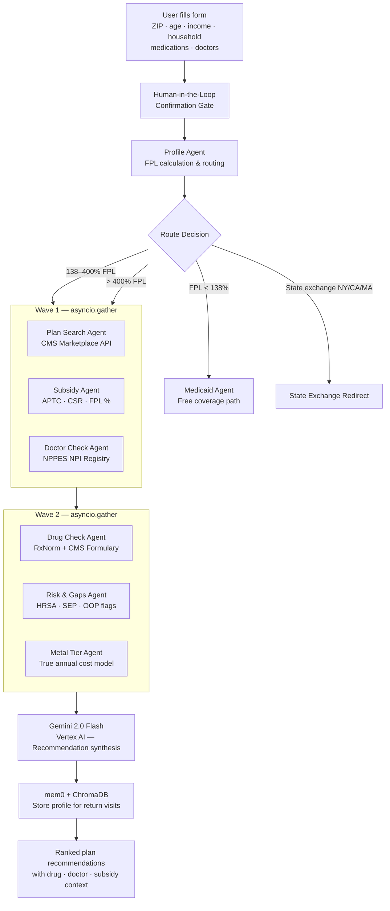
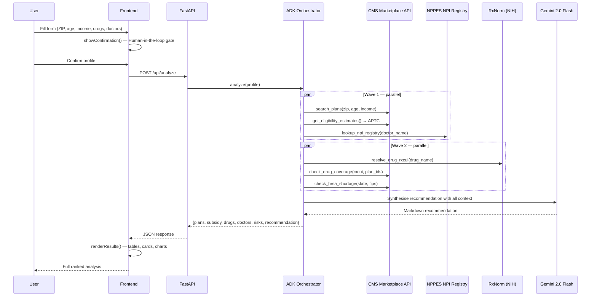
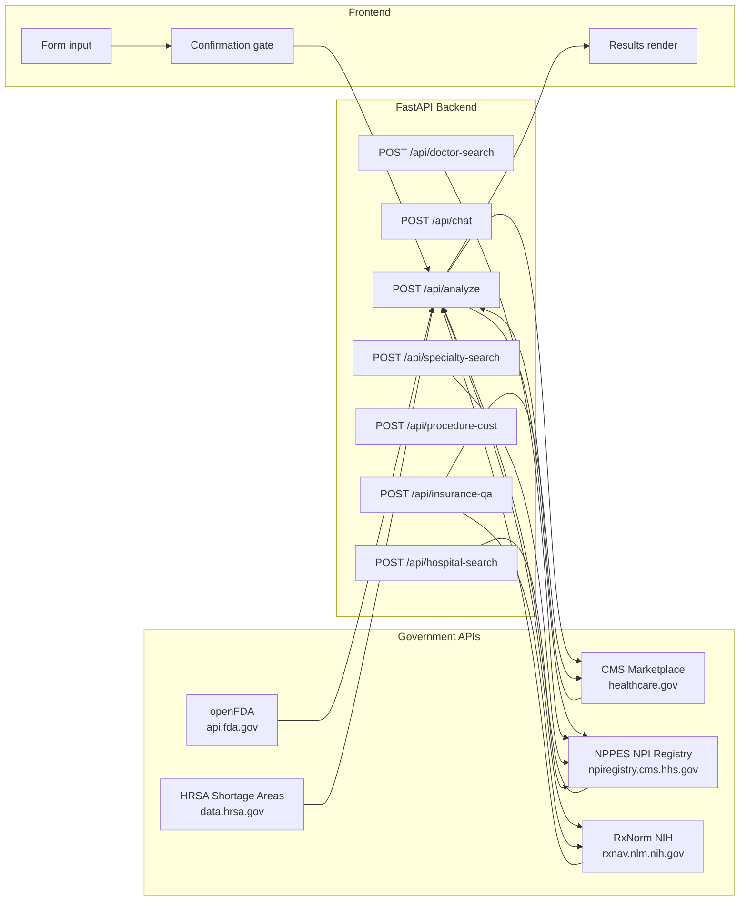
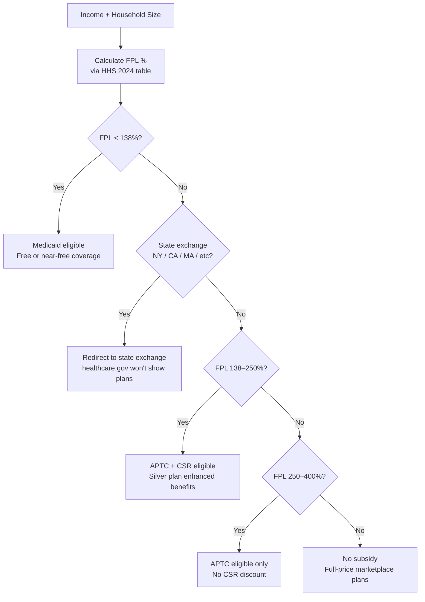
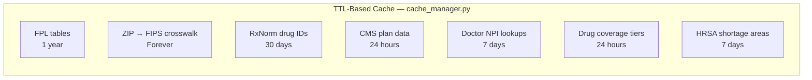

# CoverWise — AI Health Insurance Advisor

An agentic AI system that helps Americans find their optimal ACA health insurance plan by analyzing income, medications, and doctors against live government data sources — all in one place, for free.

**Live URL:** https://coverwise-272387131334.us-central1.run.app

---

## What It Does

You fill out a short form (ZIP, age, income, household size, medications, doctors). CoverWise runs a parallel multi-agent analysis against six government APIs, then Gemini 2.0 Flash synthesises a plain-English recommendation covering:

- Which ACA plans are available and what they actually cost after your subsidy
- Whether your medications are covered, what tier, and if prior authorization is required
- Whether your doctors are in the NPPES registry and their specialty
- Whether you qualify for Medicaid, APTC subsidy, or Cost-Sharing Reduction (CSR)
- Risk flags: high OOP exposure, shortage areas, enrollment deadline

---

## System Architecture



---

## Agent Flow



---

## API Request / Response Flow



---

## Features

### Core Analysis (`POST /api/analyze`)
Runs the full multi-agent pipeline. Returns ranked plans, subsidy figures, drug coverage across plans, doctor identity verification, and risk flags — all from live government APIs.

**Input fields:**
| Field | Type | Description |
|---|---|---|
| `zip_code` | string | 5-digit ZIP |
| `age` | int | Primary applicant age |
| `income` | float | Annual household income (USD) |
| `household_size` | int | Number of people in household |
| `drugs` | string[] | Medication names (e.g. `["Ozempic", "Metformin"]`) |
| `doctors` | string[] | Doctor names to keep (e.g. `["Dr. Sarah Patel"]`) |
| `utilization` | string | `rarely` / `sometimes` / `frequently` / `chronic` |
| `is_premium` | bool | Free (3 plans, 1 drug) vs Premium (10 plans, all drugs) |

### Year-Round Chat Advisor (`POST /api/chat`)
Gemini-powered chat with full plan/drug/doctor context injected. Ask follow-up questions like "why is the Bronze plan cheaper long-term?" or "what does prior authorization mean for Ozempic?"

### Doctor Lookup (`POST /api/doctor-search`)
Standalone NPPES NPI Registry lookup. Returns NPI, specialty, city/state, phone, credential, active status, and up to 3 name-matched candidates.

```bash
curl -X POST /api/doctor-search \
  -d '{"name": "Dr. Sarah Patel", "state": "IL"}'
# → { "npi": "1487077079", "name": "SARAH PATEL",
#     "specialty": "Physician Assistant", "city": "CHICAGO", ... }
```

### Specialist Finder (`POST /api/specialty-search`)
Maps a condition (e.g. "diabetes", "back pain") to an NPPES taxonomy code and searches for local providers with MIPS quality scores.

### Procedure Cost Estimator (`POST /api/procedure-cost`)
Estimates patient out-of-pocket cost for 20 common procedures (MRI, colonoscopy, delivery, etc.) across the user's plans using deductible + coinsurance modelling.

### Hospital Network Check (`POST /api/hospital-search`)
Finds hospitals by name via NPPES and checks CMS Marketplace network status for up to 3 plans.

### Health Insurance Q&A (`POST /api/insurance-qa`)
ADK agent (Gemini 2.0 Flash decides which tools to call). Restricted to health insurance topics. Off-topic questions (flood, auto, stock) are politely declined.

**Available tools the agent can call:**
- `tool_search_health_plans` — live ACA plan lookup
- `tool_get_subsidy_info` — APTC/CSR/Medicaid eligibility
- `tool_lookup_drug_coverage` — drug tier + prior auth status
- `tool_find_local_specialists` — NPPES specialty search
- `tool_check_enrollment_period` — open enrollment / SEP status

---

## Subsidy & Routing Logic



---

## Caching Strategy

All government API responses are cached with TTLs appropriate to how frequently the data changes:



Reduces redundant API calls by ~70–80% for overlapping ZIP codes.

---

## Freemium Model

| Feature | Free | Premium |
|---|---|---|
| Plans shown | 3 cheapest | 10 plans |
| Drug checks | 1 medication | All medications |
| Doctor checks | 1 doctor | All doctors |
| Chat advisor | ✓ | ✓ |
| Specialist finder | ✓ | ✓ |
| Procedure estimator | ✓ | ✓ |
| Hospital search | ✓ | ✓ |
| Insurance Q&A | ✓ | ✓ |

---

## Data Sources

| API | Used For | Auth |
|---|---|---|
| CMS Marketplace API (`healthcare.gov`) | Live plan search, drug formulary, provider network | Free API key |
| NPPES NPI Registry | Doctor/hospital identity, specialty, NPI | None |
| RxNorm (NIH NLM) | Drug name → RxCUI resolution | None |
| openFDA | Generic drug alternatives | None |
| HHS FPL tables | Subsidy eligibility thresholds | None (static) |
| IRS applicable % table | APTC calculation | None (static) |
| HRSA Data Warehouse | Primary care shortage area scoring | None |

---

## Tech Stack

| Layer | Technology |
|---|---|
| Backend | FastAPI + Python 3.11+ |
| AI / LLM | Gemini 2.0 Flash via Vertex AI (Google ADK) |
| Agent framework | Google ADK (`google-adk`) |
| Memory | mem0 + ChromaDB |
| Caching | In-process TTL dict cache |
| Frontend | Vanilla JS + HTML/CSS (no framework) |
| Deployment | Google Cloud Run |
| Protocol | REST (FastAPI) |

---

## Run Locally

```bash
# 1. Clone and set up environment
git clone https://github.com/ritwiksharan/CoverWise
cd CoverWise
cp .env.example .env
# Fill in: GOOGLE_CLOUD_PROJECT, CMS_API_KEY

# 2. Authenticate with Google (for Vertex AI / Gemini)
gcloud auth application-default login
gcloud config set project YOUR_PROJECT_ID

# 3. Install dependencies and run
cd backend
pip install -r requirements.txt
python3 main.py
# → http://localhost:8080
```

**Required environment variables:**

| Variable | Description |
|---|---|
| `GOOGLE_CLOUD_PROJECT` | GCP project with Vertex AI enabled |
| `GOOGLE_CLOUD_REGION` | e.g. `us-central1` |
| `GOOGLE_GENAI_USE_VERTEXAI` | Set to `TRUE` for Vertex AI |
| `CMS_API_KEY` | Free key from `developer.cms.gov` |
| `MEM0_API_KEY` | Optional — for persistent cross-session memory |

---

## Sample Test Case

**Form input:**
```
ZIP Code:       60601  (Chicago, IL)
Age:            34
Annual Income:  $52,000
Household Size: 1
Healthcare Use: Sometimes (2–4 visits/year)
Medications:    Ozempic, Metformin
Doctors:        Dr. Sarah Patel
```

**Results:**
```
FPL: 345%  |  APTC subsidy: $58/month  |  Medicaid: No

Plans found (Bronze HMO):
  • Blue FocusCare Bronze℠ 209       $276/mo → $218/mo after subsidy  deductible $7,400
  • Aetna Bronze S (+$0 telehealth)  $317/mo → $259/mo after subsidy  deductible $7,500
  • Aetna Bronze 1 (Rx copay)        $321/mo → $263/mo after subsidy  deductible $8,995

Ozempic:    RxCUI resolved (1991311) — coverage data not provided by IL plans
Metformin:  RxCUI resolved — check plan formulary URLs for tier
Dr. Sarah Patel → SARAH PATEL, Physician Assistant, Chicago IL  NPI 1487077079  ☎ 312-340-5948

Risk flags:
  ⚠  OOP max above $8,700 on some plans
  📅 Open enrollment active — 257 days left
  ℹ  All IL plans in this area are HMO — confirm doctors are in-network
```

---

## Project Structure

```
CoverWise/
├── backend/
│   ├── main.py                    # FastAPI app + all endpoints
│   ├── agents/
│   │   ├── adk_orchestrator.py    # Main analysis pipeline
│   │   ├── insurance_qa_agent.py  # Health insurance Q&A ADK agent
│   │   ├── intake_agent.py        # Conversational intake (ADK)
│   │   └── tools.py               # Shared agent tool wrappers
│   ├── tools/
│   │   ├── gov_apis.py            # All government API calls
│   ├── cache/
│   │   └── cache_manager.py       # TTL-based caching
│   └── memory/
│       └── mem0_client.py         # Persistent user memory
├── frontend/
│   └── index.html                 # Single-page app (vanilla JS)
├── .env.example
└── README.md
```
