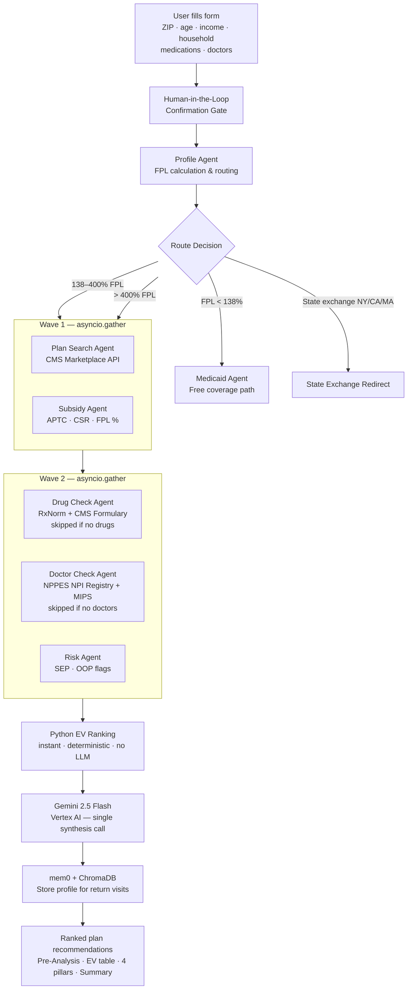
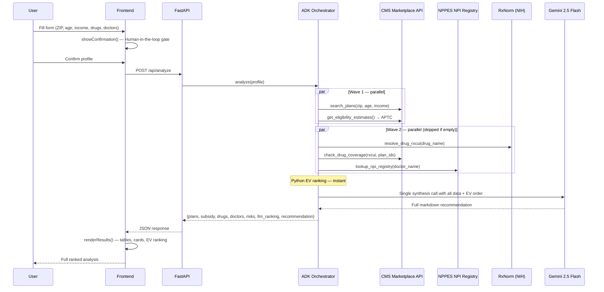
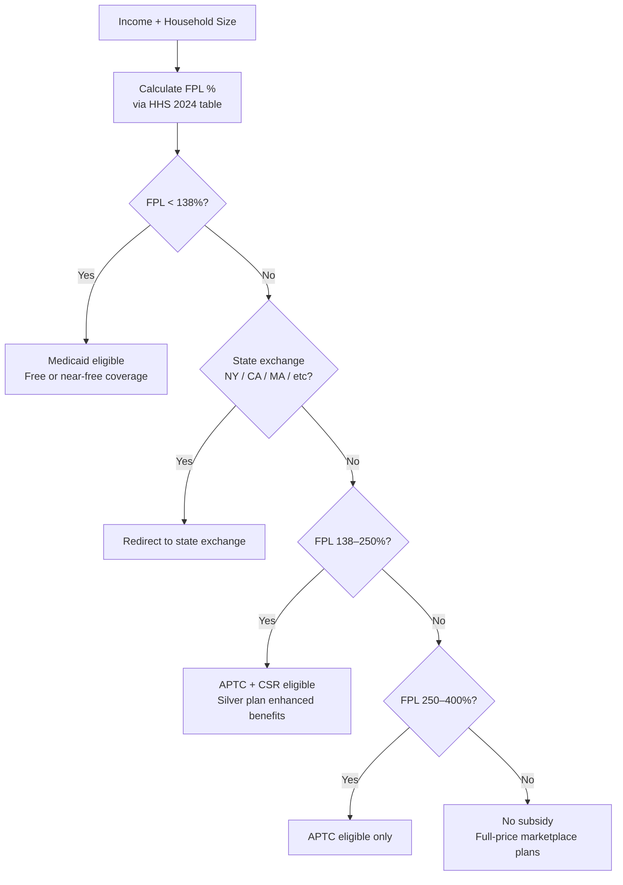
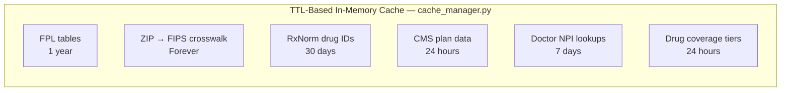

# CoverWise — AI Health Insurance Advisor

An agentic AI system that helps Americans find their optimal ACA health insurance plan by analyzing income, medications, and doctors against live government data — personalized, unbiased, and free.

**Live URL:** https://coverwise-65446133790.us-central1.run.app  
**Branch:** `adk-insurance-advisor-release`  
**Business Document:** [BUSINESS.md](./BUSINESS.md)

---

## Class Concepts Applied

### 1. Tool Use / Function Calling
The agents call six live government APIs autonomously before any LLM reasoning occurs, ensuring every dollar figure in the recommendation is real data — not a hallucination.

- **CMS Marketplace API** — live plan search, drug formulary tiers, provider network
- **NPPES NPI Registry** — doctor identity, specialty, active status
- **RxNorm (NIH)** — drug name → RxCUI resolution
- **openFDA** — generic drug alternatives
- **HHS FPL tables** — subsidy eligibility thresholds
- **CMS Eligibility API** — APTC / CSR / Medicaid calculation

File references: `backend/tools/gov_apis.py`, `backend/agents/tools.py`

---

### 2. Multi-Agent Orchestration with Parallelization
The pipeline runs three parallel data-collection waves before synthesis, keeping total latency to ~10–15 seconds despite hitting 6+ APIs.

```
Wave 0:  ZIP → FIPS → State (location lookup)
Wave 1:  asyncio.gather(subsidy_estimate, plan_search)
Wave 2:  asyncio.gather(drug_coverage*, doctor_verification*, market_risks)
         (* skipped entirely if drugs / doctors are not provided)
Phase 1.5: Python EV ranking — instant, deterministic, no LLM call
Phase 2:   Gemini 2.5 Flash synthesis → full 4-pillar recommendation
```

File reference: `backend/agents/adk_orchestrator.py` (`_collect_analysis_data`, `_rank_plans_python`, `_synthesize_with_gemini`)

---

### 3. Agentic Memory (mem0 + ChromaDB)
After every analysis, the user's profile (plan selected, drug tiers, doctor NPIs, deductible, OOP max) is stored in `mem0` backed by ChromaDB. The year-round chat advisor retrieves it on every follow-up message — enabling questions like "should I use my HSA in March?" months after the November enrollment.

File reference: `backend/memory/mem0_client.py`

---

### 4. Human-in-the-Loop (HITL) Confirmation Gate
Before the expensive multi-agent pipeline fires, the frontend renders the extracted medications, doctors, and profile back to the user for explicit confirmation. The analysis only starts on user approval.

File reference: `frontend/index.html` (`showConfirmation()`)

---

### 5. Agent Framework (Google ADK)
The year-round Insurance Q&A advisor is built on Google ADK (`google-adk`). It uses ADK tool-calling to decide at runtime which government API to query based on the user's question — plan search, drug lookup, subsidy check, specialist finder, or enrollment dates.

File reference: `backend/agents/insurance_qa_agent.py`

---

## What It Does

Fill out a short form (ZIP, age, income, household size, medications, doctors). CoverWise runs a parallel multi-agent analysis against six government APIs, then Gemini 2.5 Flash produces a plain-English recommendation covering:

- Which ACA plans are available and what they actually cost **after your subsidy**
- Whether your medications are covered, what tier, and if **prior authorization** is required
- Whether your doctors are in the NPPES registry and their quality score (MIPS)
- Whether you qualify for **Medicaid**, **APTC subsidy**, or **Cost-Sharing Reduction (CSR)**
- **EV ranking** — plans ranked by Expected Value across Healthy / Clinical / Worst-Case scenarios weighted by your utilization level
- Risk flags: high OOP exposure, enrollment deadline, subsidy cliff warnings

---

## System Architecture



---

## Agent Flow



---

## Features

### Core Analysis (`POST /api/analyze`)
Runs the full multi-agent pipeline. Returns ranked plans, subsidy figures, drug coverage across plans, doctor identity verification, EV ranking, and a full 4-pillar AI recommendation.

**Input fields:**
| Field | Type | Description |
|---|---|---|
| `zip_code` | string | 5-digit ZIP |
| `age` | int | Primary applicant age |
| `income` | float | Annual household income (USD) |
| `household_size` | int | Number of people in household |
| `drugs` | string[] | Medication names — e.g. `["Ozempic", "Metformin"]` (optional) |
| `doctors` | string[] | Doctor names to keep (optional) |
| `utilization` | string | `rarely` / `sometimes` / `frequently` / `chronic` |
| `is_premium` | bool | Free (3 plans, 1 drug, 1 doctor) vs Premium (10 plans, unlimited) |

### Year-Round Chat Advisor (`POST /api/chat`)
Gemini 2.5 Flash chat with full plan/drug/doctor context injected from mem0 memory. Ask follow-up questions months after enrollment.

### Doctor Lookup (`POST /api/doctor-search`)
NPPES NPI Registry lookup with MIPS quality score. Returns NPI, specialty, city/state, phone, credential, active status.

### Specialist Finder (`POST /api/specialty-search`)
Maps a condition (e.g. "diabetes", "back pain") to a taxonomy code and finds local providers with quality scores.

### Procedure Cost Estimator (`POST /api/procedure-cost`)
Estimates patient out-of-pocket cost for 20 common procedures across the user's plans using deductible + coinsurance modelling.

### Hospital Network Check (`POST /api/hospital-search`)
Finds hospitals by name via NPPES and checks CMS Marketplace network status.

### Health Insurance Q&A (`POST /api/insurance-qa`)
ADK-powered agent. Restricted to health insurance topics via few-shot prompting. Calls live government APIs at runtime based on question intent.

---

## Freemium Model

| Feature | Free | Premium ($19/mo) |
|---|---|---|
| Plans shown | 3 cheapest | 10 plans |
| Drug checks | 1 medication | Unlimited |
| Doctor checks | 1 doctor | Unlimited |
| EV ranking + AI recommendation | ✓ | ✓ (deeper) |
| Chat advisor | ✓ | ✓ (full context) |
| HSA 5-year wealth forecast | — | ✓ |
| Specialist finder | ✓ | ✓ |
| Procedure estimator | ✓ | ✓ |

---

## Token Economics

### Gemini 2.5 Flash Pricing
| Token type | Price |
|---|---|
| Input | $0.075 / 1M tokens |
| Output (non-thinking) | $0.30 / 1M tokens |
| Output (thinking, if budget fires) | $3.50 / 1M tokens |

### Tokens per Operation

Every full analysis makes exactly one Gemini call. The system prompt (`ORCHESTRATOR_INSTRUCTION`) is ~1,500 tokens. The synthesis prompt (`_build_synthesis_prompt`) scales with the number of plans, drugs, and doctors injected.

| Operation | Input tokens | Output tokens | Total |
|---|---|---|---|
| Full analysis — Free (3 plans, 1 drug, 1 doctor) | ~4,000 | ~2,000 | **~6,000** |
| Full analysis — Premium (10 plans, 3 drugs, 3 doctors) | ~7,000 | ~3,500 | **~10,500** |
| Chat message — Free (rebuilds full synthesis prompt + prior rec + question each turn) | ~4,800 | ~500 | **~5,300** |
| Chat message — Premium | ~7,800 | ~800 | **~8,600** |
| Insurance Q&A — no tool call | ~830 | ~300 | **~1,130** |
| Insurance Q&A — with tool call (2-pass: question → tool → answer) | ~1,800 | ~400 | **~2,200** |

> Note: `chat()` calls `_build_synthesis_prompt()` in full on every message — the entire data document is re-injected each turn. Architecturally wasteful; a cached delta approach could cut chat token cost by ~60%.

### Cost per Operation

| Operation | Input $ | Output $ | **Total $** |
|---|---|---|---|
| Full analysis — Free | $0.000300 | $0.000600 | **$0.0009** |
| Full analysis — Premium | $0.000525 | $0.001050 | **$0.0016** |
| Chat message — Free | $0.000360 | $0.000150 | **$0.0005** |
| Chat message — Premium | $0.000585 | $0.000240 | **$0.0008** |
| Insurance Q&A (avg, 1 tool call) | $0.000135 | $0.000120 | **$0.00025** |

### One-User-Month: Cost to Serve

**Free user** — enrollment window visitor, uses the tool once or twice:

| Activity | Count/mo | Cost each | Subtotal |
|---|---|---|---|
| Full analysis runs | 1.5 | $0.0009 | $0.0014 |
| Chat follow-ups | 2.5 | $0.0005 | $0.0013 |
| Q&A questions | 1.5 | $0.00025 | $0.0004 |
| Cloud Run compute (shared) | — | — | ~$0.010 |
| **Total cost to serve** | | | **~$0.013** |

**Premium user** — actively using year-round:

| Activity | Count/mo | Cost each | Subtotal |
|---|---|---|---|
| Full analysis runs | 2.5 | $0.0016 | $0.0040 |
| Chat messages | 12 | $0.0008 | $0.0096 |
| Q&A questions | 7 | $0.00025 | $0.0018 |
| Cloud Run compute | — | — | ~$0.020 |
| **Total cost to serve** | | | **~$0.036** |

### The P&L

| | Free | Premium |
|---|---|---|
| Revenue | $0 | **$19.00** |
| LLM cost | $0.003 | $0.016 |
| Infra (Cloud Run) | $0.010 | $0.020 |
| **Total cost to serve** | **$0.013** | **$0.036** |
| **Gross margin** | **−$0.013/user** | **$18.96 = 99.8%** |

The unit economics are excellent. You could absorb a 10× power user (25 analyses, 100 chat messages) for under $0.30 in tokens.

### Where It Breaks

**Thinking tokens** — `gemini-2.5-flash` can fire a thinking budget automatically. If it does, output cost jumps from $0.30/M to $3.50/M. Premium user LLM cost rises from ~$0.016 to ~$0.18/month. Still under 1% of revenue, but worth setting `thinking_config={"thinking_budget": 0}` explicitly if synthesis quality is acceptable without it.

**Seasonality** — Open enrollment runs Nov 15–Jan 15 (60 days). Outside that window there is almost nothing to analyze. The realistic subscription pattern: user subscribes in November, cancels in February → **LTV ≈ $19–$38**. If CAC via paid ads is $30–$50, the model is break-even or underwater on acquisition. The year-round advisor feature is the retention play, but that has to be proven.

**Conversion math** — At 3% free-to-premium conversion and 60% monthly churn after enrollment season:
- 1,000 free users → 30 premium → ~12 retained in month 2
- LTV per converted user ≈ $19 / (1 − 0.4) = **~$32 over lifetime**
- This only works if CAC < $32, which means essentially organic / SEO traffic

**Missing revenue layer** — Traditional insurance tech earns **$20–$100/enrolled member/month** in broker commissions from carriers (eHealth, GoHealth, SelectQuote all operate this way). At $19/month from the user, the larger revenue stream is being left on the table. Adding licensed broker referral fees on top of the subscription could 5–10× LTV without changing the cost structure.

---

## Subsidy & Routing Logic



---

## EV Ranking Formula

Plans are ranked by Expected Value computed in Python using utilization-adjusted weights:

```
EV = (w_healthy × Healthy Year cost) + (w_clinical × Clinical Year cost) + (w_worst × Worst Case cost)

utilization = "rarely"     → weights: 0.50 / 0.30 / 0.20
utilization = "sometimes"  → weights: 0.30 / 0.40 / 0.30
utilization = "frequently" → weights: 0.20 / 0.50 / 0.30
utilization = "chronic"    → weights: 0.15 / 0.40 / 0.45

Healthy Year  = annual premium only
Clinical Year = annual premium + estimated drug costs
Worst Case    = annual premium + full OOP Max

Lowest EV = rank 1 (best plan for this user)
```

CSR override: if the user is CSR-eligible (FPL 138–250%), the top Silver plan is always placed at rank 1 regardless of raw EV — the deductible reduction dominates.

---

## Caching Strategy



Reduces external API calls by ~75% for overlapping ZIP codes in a session.

---

## Data Sources

| API | Used For | Auth |
|---|---|---|
| CMS Marketplace API (`healthcare.gov`) | Plan search, drug formulary, provider network | Free API key |
| NPPES NPI Registry | Doctor/hospital identity, specialty, NPI | None |
| RxNorm (NIH NLM) | Drug name → RxCUI resolution | None |
| openFDA | Generic drug alternatives | None |
| HHS FPL tables | Subsidy eligibility thresholds | None (static) |
| IRS applicable % table | APTC calculation | None (static) |

---

## Tech Stack

| Layer | Technology |
|---|---|
| Backend | FastAPI + Python 3.11 |
| AI / LLM | Gemini 2.5 Flash via Vertex AI |
| Agent framework | Google ADK (`google-adk`) |
| Memory | mem0 + ChromaDB |
| Caching | In-process TTL dict cache |
| Frontend | Vanilla JS + HTML/CSS (no framework) |
| Deployment | Google Cloud Run (4 GiB, 2 vCPU) |

---

## Run Locally

```bash
# 1. Clone and set up environment
git clone https://github.com/ritwiksharan/CoverWise
cd CoverWise
git checkout adk-insurance-advisor-release

# 2. Set environment variables
cp .env.example .env
# Edit .env:
#   GOOGLE_CLOUD_PROJECT=your-gcp-project-id
#   GOOGLE_CLOUD_REGION=us-central1
#   GOOGLE_GENAI_USE_VERTEXAI=TRUE
#   CMS_API_KEY=your-free-key-from-developer.cms.gov
#   FORCE_OPEN_ENROLLMENT=TRUE

# 3. Authenticate with Google (for Vertex AI / Gemini 2.5 Flash)
gcloud auth application-default login
gcloud config set project your-gcp-project-id

# 4. Install dependencies and run
cd backend
pip install -r requirements.txt
uvicorn main:app --host 0.0.0.0 --port 8080
# → http://localhost:8080
```

**Required environment variables:**

| Variable | Description |
|---|---|
| `GOOGLE_CLOUD_PROJECT` | GCP project with Vertex AI + Agent Builder APIs enabled |
| `GOOGLE_CLOUD_REGION` | e.g. `us-central1` |
| `GOOGLE_GENAI_USE_VERTEXAI` | `TRUE` to use Vertex AI (no API key needed) |
| `CMS_API_KEY` | Free key from `developer.cms.gov` |
| `FORCE_OPEN_ENROLLMENT` | `TRUE` to override enrollment window for demos |

---

## Sample Test Case

**Form input:**
```
ZIP Code:       60601  (Chicago, IL)
Age:            34
Annual Income:  $52,000
Household Size: 1
Healthcare Use: Sometimes (2–4 visits/year)
Medications:    Ozempic, Metformin
Doctors:        Dr. Sarah Patel
```

**Results (abbreviated):**
```
FPL: 345%  |  APTC: $58/month  |  Medicaid: No

EV Ranking (sometimes weights: 0.3/0.4/0.3):
  #1  Blue FocusCare Bronze℠ 209   EV $5,847   $218/mo after subsidy
  #2  Aetna Bronze S               EV $5,921   $259/mo after subsidy
  #3  Aetna Bronze 1 (Rx copay)    EV $6,104   $263/mo after subsidy

Ozempic:    Tier 5 — Prior Auth required (30+ day delay if denied)
Metformin:  Tier 1 Generic — ~$10/mo copay across all plans
Dr. Sarah Patel → NPI 1487077079  Physician Assistant, Chicago IL  ☎ 312-340-5948

Risk flags:
  ⚠  OOP max above $8,700 on 2 plans
  📅 Open enrollment active — 256 days left (deadline 2027-01-15)
  ℹ  All IL plans in this area are HMO — confirm doctors are in-network
```

---

## Project Structure

```
CoverWise/
├── backend/
│   ├── main.py                    # FastAPI app + all endpoints
│   ├── requirements.txt
│   ├── agents/
│   │   ├── adk_orchestrator.py    # Main pipeline: data collection, Python EV ranking, Gemini synthesis
│   │   ├── insurance_qa_agent.py  # ADK-powered health insurance Q&A (few-shot topic guard)
│   │   ├── intake_agent.py        # Conversational intake (Google ADK)
│   │   └── tools.py               # Agent tool wrappers (drug + doctor agents with empty-input guards)
│   ├── tools/
│   │   └── gov_apis.py            # All government API calls + TTL caching
│   ├── cache/
│   │   └── cache_manager.py       # TTL-based in-memory cache
│   └── memory/
│       └── mem0_client.py         # Persistent user memory (mem0 + ChromaDB)
├── frontend/
│   └── index.html                 # Single-page app (vanilla JS, no framework)
├── Dockerfile                     # Cloud Run container (ChromaDB ONNX model pre-baked)
├── BUSINESS.md                    # Business one-pager
└── README.md
```
