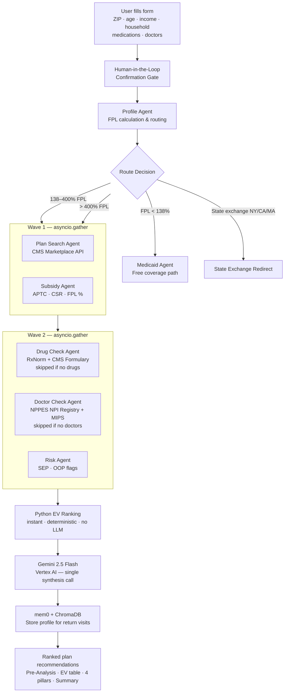
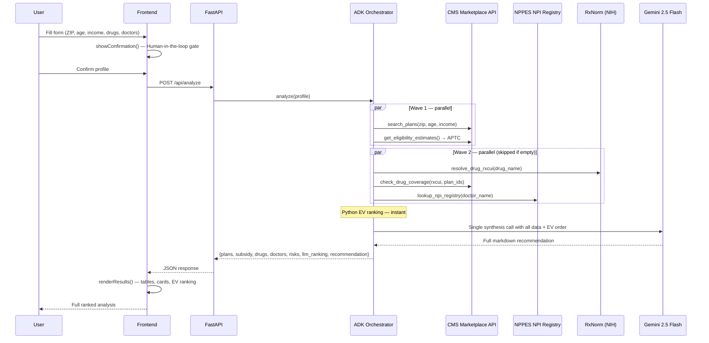
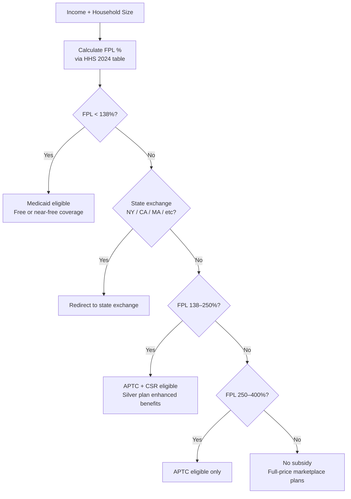
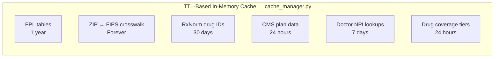

# CoverWise — AI Health Insurance Advisor

An agentic AI system that helps Americans find their optimal ACA health insurance plan by analyzing income, medications, and doctors against live government data — personalized, unbiased, and free.

CoverWise currently supports live plan analysis for 30 federal marketplace states including Texas, Florida, Tennessee, Georgia, Arizona, Illinois, Ohio, Michigan, North Carolina, and more. For the remaining 20 states and DC that operate their own exchanges (NY, CA, WA, CO, CT, KY, ME, MD, MA, MN, NV, NJ, NM, PA, RI, VT, VA, DC, ID, OR), CoverWise automatically detects the state from the ZIP code and redirects users directly to their state exchange with a direct link.

**Live URL:** https://coverwise-272387131334.us-central1.run.app/

**Business Document:** [BUSINESS.md](./BUSINESS.md)  
**Slides:** [slides-export.pdf](./slides-export.pdf)

**Demo:** https://drive.google.com/file/d/1n7LG_cTQXodoPw2Q7d2OlBakv7nL0Nh6/view?usp=sharing

---

## Business Pitch

### The User

**Primary:** The 21.4 million Americans who buy health insurance on the ACA Marketplace without an employer HR department to guide them — freelancers, gig workers (Uber, DoorDash, Upwork), self-employed small-business owners, and people between jobs.

**Secondary:** The 160 million Americans with employer coverage who face annual open enrollment and have no idea whether the "better" plan actually costs less given their specific medications and doctors.

**Concrete persona:** Maria, 34, a Chicago-based graphic designer. She earns $52,000 freelancing, takes Ozempic for Type 2 diabetes and Metformin, and sees her endocrinologist quarterly. Every November she spends 4–6 hours on healthcare.gov trying to figure out whether a Bronze plan with a $7,400 deductible is cheaper than a Silver plan with a $3,000 deductible — and she still doesn't know if Ozempic is covered or whether her doctor is in-network. She has been making the wrong call for three years.

### The Problem

**Health insurance is the highest-stakes financial decision most Americans make every year, and almost no one makes it well.**

- The average American overspends $1,500–$2,500/year on health insurance by choosing the wrong plan for their actual utilization and medications (Kaiser Family Foundation, 2023).
- Healthcare.gov shows 50–90 plans per ZIP code. None of them tell you your true cost after your actual medications, your actual doctors, and your actual utilization are factored in.
- Navigating this requires cross-referencing 5+ government websites (CMS Marketplace, NPPES NPI Registry, each insurer's formulary, HRSA shortage databases, IRS APTC tables) that most people don't know exist.

**What people do today:** They click the lowest premium, or they call a broker who earns a commission from the insurer — a direct conflict of interest. Neither approach accounts for drug tier costs, prior authorization requirements, or out-of-pocket max exposure.

**Why CoverWise:** The only free tool that cross-references your exact medications (RxNorm + CMS formulary), your specific doctors (NPPES NPI), your subsidy eligibility (FPL calculation), and healthcare utilization into a single ranked recommendation. No commissions. No conflict of interest.

---

## Class Concepts Applied

### 1. Tool Use / Function Calling
The agents call six live government APIs autonomously before any LLM reasoning occurs, ensuring every dollar figure in the recommendation is real data — not a hallucination.

- **CMS Marketplace API** — live plan search, drug formulary tiers, provider network
- **NPPES NPI Registry** — doctor identity, specialty, active status
- **RxNorm (NIH)** — drug name → RxCUI resolution
- **openFDA** — generic drug alternatives
- **HHS FPL tables** — subsidy eligibility thresholds
- **CMS Eligibility API** — APTC / CSR / Medicaid calculation

File references: `backend/tools/gov_apis.py`, `backend/agents/tools.py`

---

### 2. Multi-Agent Orchestration with Parallelization
The pipeline runs three parallel data-collection waves before synthesis, keeping total latency to ~10–15 seconds despite hitting 6+ APIs.

```
Wave 0:  ZIP → FIPS → State (location lookup)
Wave 1:  asyncio.gather(subsidy_estimate, plan_search)
Wave 2:  asyncio.gather(drug_coverage*, doctor_verification*, market_risks)
         (* skipped entirely if drugs / doctors are not provided)
Phase 1.5: Python EV ranking — instant, deterministic, no LLM call
Phase 2:   Gemini 2.5 Flash synthesis → full 4-pillar recommendation
```

File reference: `backend/agents/adk_orchestrator.py` (`_collect_analysis_data`, `_rank_plans_python`, `_synthesize_with_gemini`)

---

### 3. Agentic Memory (mem0 + ChromaDB)
After every analysis, the user's profile (plan selected, drug tiers, doctor NPIs, deductible, OOP max) is stored in `mem0` backed by ChromaDB. The year-round chat advisor retrieves it on every follow-up message — enabling questions like "should I use my HSA in March?" months after the November enrollment.

File reference: `backend/memory/mem0_client.py`

---

### 4. Human-in-the-Loop (HITL) Confirmation Gate
Before the expensive multi-agent pipeline fires, the frontend renders the extracted medications, doctors, and profile back to the user for explicit confirmation. The analysis only starts on user approval.

File reference: `frontend/index.html` (`showConfirmation()`)

---

### 5. Agent Framework (Google ADK)
The year-round Insurance Q&A advisor is built on Google ADK (`google-adk`). It uses ADK tool-calling to decide at runtime which government API to query based on the user's question — plan search, drug lookup, subsidy check, specialist finder, or enrollment dates.

File reference: `backend/agents/insurance_qa_agent.py`

---

## What It Does

Fill out a short form (ZIP, age, income, household size, medications, doctors). CoverWise runs a parallel multi-agent analysis against six government APIs, then Gemini 2.5 Flash produces a plain-English recommendation covering:

- Which ACA plans are available and what they actually cost **after your subsidy**
- Whether your medications are covered, what tier, and if **prior authorization** is required
- Whether your doctors are in the NPPES registry and their quality score (MIPS)
- Whether you qualify for **Medicaid**, **APTC subsidy**, or **Cost-Sharing Reduction (CSR)**
- **EV ranking** — plans ranked by Expected Value across Healthy / Clinical / Worst-Case scenarios weighted by your utilization level
- Risk flags: high OOP exposure, enrollment deadline, subsidy cliff warnings

---

## System Architecture



---

## Agent Flow



---

## Features

### Core Analysis (`POST /api/analyze`)
Runs the full multi-agent pipeline. Returns ranked plans, subsidy figures, drug coverage across plans, doctor identity verification, EV ranking, and a full 4-pillar AI recommendation.

**Input fields:**
| Field | Type | Description |
|---|---|---|
| `zip_code` | string | 5-digit ZIP |
| `age` | int | Primary applicant age |
| `income` | float | Annual household income (USD) |
| `household_size` | int | Number of people in household |
| `drugs` | string[] | Medication names — e.g. `["Ozempic", "Metformin"]` (optional) |
| `doctors` | string[] | Doctor names to keep (optional) |
| `utilization` | string | `rarely` / `sometimes` / `frequently` / `chronic` |
| `is_premium` | bool | Free (3 plans, 1 drug, 1 doctor) vs Premium (10 plans, unlimited) |

### Year-Round Chat Advisor (`POST /api/chat`)
Gemini 2.5 Flash chat with full plan/drug/doctor context injected from mem0 memory. Ask follow-up questions months after enrollment.

### Conversational Intake (`POST /api/intake/start` · `POST /api/intake/message`)
Google ADK-powered conversational intake agent. Collects ZIP, age, income, household size, medications, and doctors through a natural-language conversation before handing off to the analysis pipeline.

### Doctor Lookup (`POST /api/doctor-search`)
NPPES NPI Registry lookup with MIPS quality score. Returns NPI, specialty, city/state, phone, credential, active status.

### Specialist Finder (`POST /api/specialty-search`)
Maps a condition (e.g. "diabetes", "back pain") to a taxonomy code and finds local providers with quality scores.

### Procedure Cost Estimator (`POST /api/procedure-cost`)
Estimates patient out-of-pocket cost for 20 common procedures across the user's plans using deductible + coinsurance modelling.

### Hospital Network Check (`POST /api/hospital-search`)
Finds hospitals by name via NPPES and checks CMS Marketplace network status.

### Nearby Hospitals (`GET /api/hospitals/nearby/{zip_code}`)
Returns hospitals near a ZIP code without requiring a name search. Checks network status against up to 3 plan IDs.

### Plan Providers (`POST /api/plan-providers`)
Returns NPPES providers for a given plan ID and specialty near a ZIP code, with a link to the insurer's provider directory for network verification.

### Health Insurance Q&A (`POST /api/insurance-qa`)
ADK-powered agent. Restricted to health insurance topics via few-shot prompting. Calls live government APIs at runtime based on question intent.

---

## Freemium Model

| Feature | Free | Premium ($19/mo) |
|---|---|---|
| Plans shown | 3 cheapest | 10 plans |
| Drug checks | 1 medication | Unlimited |
| Doctor checks | 1 doctor | Unlimited |
| EV ranking + AI recommendation | ✓ | ✓ (deeper) |
| Chat advisor | ✓ | ✓ (full context) |
| HSA 5-year wealth forecast | — | ✓ |
| Specialist finder | ✓ | ✓ |
| Procedure estimator | ✓ | ✓ |

---

## Token Economics

### Gemini 2.5 Flash Pricing
| Token type | Price |
|---|---|
| Input | $0.075 / 1M tokens |
| Output (non-thinking) | $0.30 / 1M tokens |
| Output (thinking, if budget fires) | $3.50 / 1M tokens |

### Per-Call Breakdown (grounded in actual code)

Every `/api/analyze` runs **one LLM call**. EV ranking is computed instantly in Python (`_rank_plans_python`) — pure weighted arithmetic, zero LLM cost. Only the synthesis step uses Gemini.

**Phase 1.5 — Python EV Ranking** (`_rank_plans_python`): $0.00

**Phase 2 — Synthesis** (`_synthesize_with_gemini`, model: `gemini-2.5-flash`):

| Component | Tokens | Rate | Cost |
|---|---|---|---|
| System: `ORCHESTRATOR_INSTRUCTION` (section order, pillar rules, ranking rule) | ~975 | $0.075/1M | $0.000073 |
| User: full structured data doc — plan tables, 3 scenario tables, drug coverage per plan, doctor NPI data, subsidy, risk flags, Python EV ranking | ~3,025 | $0.075/1M | $0.000227 |
| Output: full markdown recommendation (Pre-Analysis + EV table + 4 pillars + Summary) | ~1,500 | $0.300/1M | $0.000450 |
| **Phase 2 total** | **~5,500** | | **$0.000750** |

**Total per `/api/analyze` (10 plans, 2 drugs, 1 doctor): ~5,500 tokens → $0.00075**

---

**Per `/api/chat` follow-up** (`_synthesize_with_gemini` called directly):

| Component | Tokens | Cost |
|---|---|---|
| System: `ORCHESTRATOR_INSTRUCTION` | ~975 | |
| User: full data doc (same synthesis prompt rebuilt each turn) + prior recommendation (first 3,000 chars) + user question | ~3,825 | |
| Output: focused answer | ~125 | |
| **Total** | **~4,925** | **$0.00040** |

> `chat()` re-sends the entire data document on every message — the dominant per-session cost. A cached delta approach could cut this by ~60%.

---

**Per `/api/insurance-qa`** (ADK agent, 2 LLM passes):

| Pass | Input | Output | Cost |
|---|---|---|---|
| Pass 1: intent + tool selection | ~600 tokens | ~50 tokens | $0.000060 |
| Pass 2: tool result → answer | ~400 tokens | ~75 tokens | $0.000053 |
| **Total** | **~1,125** | | **$0.000113** |

---

### One-User-Month: Cost to Serve

**Free user** — enrollment window visitor, 1 analysis + 3 chats + 2 Q&As:
- LLM: ~$0.0018/user/month
- 1,000 free users = **$1.78/month** in LLM costs
- Infra negligible at this scale (Cloud Run scales to zero)

**Premium user ($19/month)** — 1 analysis + 8 chats + 4 Q&As:

| Item | Monthly Cost |
|---|---|
| Phase 2 Synthesis (1x @ $0.00075) | $0.000750 |
| Chat follow-ups (8x x $0.00040) | $0.003200 |
| Insurance Q&A (4x x $0.000113) | $0.000452 |
| **Total LLM** | **$0.0044** |
| Cloud Run (4 GiB / 2 vCPU / ~40 req) | $0.040 |
| mem0 + ChromaDB storage | $0.005 |
| Government APIs (CMS, NPPES, RxNorm) | $0.000 |
| **Total cost to serve** | **$0.050** |
| **Revenue** | **$19.00** |
| **Gross margin** | **99.7%** |

You could absorb a 10x power user (25 analyses, 100 chat messages) for under $0.30 in tokens.

### Where It Breaks

**Thinking tokens** — `gemini-2.5-flash` can fire a thinking budget automatically. If it does, output cost jumps $0.30/M to $3.50/M. Premium LLM cost rises from ~$0.004 to ~$0.045/month. Still under 1% of revenue, but worth setting `thinking_config={"thinking_budget": 0}` explicitly if synthesis quality holds without it.

**Seasonality** — Open enrollment is Nov 15–Jan 15 (60 days). Outside that window there is almost nothing to analyze. The realistic subscription pattern: user subscribes November, cancels February — **LTV ~$19–$38**. If CAC via paid ads is $30–$50, the model is break-even or underwater on acquisition. The year-round advisor is the retention play — it has to be proven.

**Conversion math** — At 3% free-to-premium conversion and 60% post-enrollment churn:
- 1,000 free users → 30 premium → ~12 retained in month 2
- LTV per converted user = $19 / (1 - 0.4) = **~$32**
- Only works if CAC < $32 — essentially organic / SEO only

**Missing revenue layer** — Traditional insurance tech earns **$20–$100/enrolled member/month** in broker commissions from carriers (eHealth, GoHealth, SelectQuote). At $19/month from the user, the larger stream is untapped. Licensed broker referral fees on top of the subscription could 5–10x LTV without changing the cost structure.

**Path to $100K ARR:**
- ~440 premium subscribers at $19/month
- At 3% conversion: ~15,000 free users needed
- Open enrollment (Nov–Jan) drives 60–70% of annual sign-ups — SEO on "ACA plan comparison", "health insurance calculator" is the primary acquisition channel

**Fixed cost floor:** Cloud Run minimum + domain ~$15/month regardless of user count. Breakeven: **1 premium subscriber** covers fixed costs; 2 covers all LLM costs for ~400 free users.

---

## Competitive Landscape

| | CoverWise | healthcare.gov | eHealth.com | Local Broker |
|---|---|---|---|---|
| Personalized drug analysis | Yes | No | No | Sometimes |
| Doctor NPI verification | Yes | No | No | Rarely |
| Subsidy calculation | Yes | Yes | Yes | Yes |
| No commission conflict | Yes | Yes | No | No |
| Year-round AI advisor | Yes | No | No | No |
| Price | Free / $19/mo | Free | Free (lead-gen) | Free (commission) |

---

## Risk & Mitigation

| Risk | Mitigation |
|---|---|
| CMS API availability / rate limits | TTL cache absorbs ~75% of calls; graceful degradation returns data-only results without synthesis |
| LLM cost spike at scale | Gemini 2.5 Flash is cost-efficient for structured summarization; hard rate limits per user tier |
| "Not a licensed insurance broker" liability | Explicit disclaimer on every output: "This is informational only. CoverWise is not a licensed insurance broker. Verify all plan details on healthcare.gov." |
| Open enrollment seasonality | Year-round advisor and mid-year SEP guidance smooth monthly revenue; plan for 70% of annual sign-ups in Nov–Jan |

---

## Subsidy & Routing Logic



---

## EV Ranking Formula

Plans are ranked by Expected Value computed in Python using utilization-adjusted weights:

```
EV = (w_healthy × Healthy Year cost) + (w_clinical × Clinical Year cost) + (w_worst × Worst Case cost)

utilization = "rarely"     → weights: 0.50 / 0.30 / 0.20
utilization = "sometimes"  → weights: 0.30 / 0.40 / 0.30
utilization = "frequently" → weights: 0.20 / 0.50 / 0.30
utilization = "chronic"    → weights: 0.15 / 0.40 / 0.45

Healthy Year  = annual premium only
Clinical Year = annual premium + estimated drug costs
Worst Case    = annual premium + full OOP Max

Lowest EV = rank 1 (best plan for this user)
```

CSR override: if the user is CSR-eligible (FPL 138–250%), the top Silver plan is always placed at rank 1 regardless of raw EV — the deductible reduction dominates.

---

## Caching Strategy



Reduces external API calls by ~75% for overlapping ZIP codes in a session.

---

## Data Sources

| API | Used For | Auth |
|---|---|---|
| CMS Marketplace API (`healthcare.gov`) | Plan search, drug formulary, provider network | Free API key |
| NPPES NPI Registry | Doctor/hospital identity, specialty, NPI | None |
| RxNorm (NIH NLM) | Drug name → RxCUI resolution | None |
| openFDA | Generic drug alternatives | None |
| HHS FPL tables | Subsidy eligibility thresholds | None (static) |
| IRS applicable % table | APTC calculation | None (static) |

---

## Tech Stack

| Layer | Technology |
|---|---|
| Backend | FastAPI + Python 3.11 |
| AI / LLM | Gemini 2.5 Flash via Vertex AI |
| Agent framework | Google ADK (`google-adk`) |
| Memory | mem0 + ChromaDB |
| Formulary RAG | `rag/formulary_store.py` — seeded at startup from insurer MRF JSON |
| Caching | In-process TTL dict cache |
| Auth | `auth/router.py` + `auth/db.py` |
| Frontend | Vanilla JS + HTML/CSS (no framework) |
| Deployment | Google Cloud Run (4 GiB, 2 vCPU) |

---

## Run Locally

```bash
# 1. Clone and set up environment
git clone https://github.com/ritwiksharan/CoverWise
cd CoverWise
git checkout adk-insurance-advisor-release

# 2. Set environment variables
cp .env.example .env
# Edit .env:
#   GOOGLE_CLOUD_PROJECT=your-gcp-project-id
#   GOOGLE_CLOUD_REGION=us-central1
#   GOOGLE_GENAI_USE_VERTEXAI=TRUE
#   CMS_API_KEY=your-free-key-from-developer.cms.gov
#   FORCE_OPEN_ENROLLMENT=TRUE

# 3. Authenticate with Google (for Vertex AI / Gemini 2.5 Flash)
gcloud auth application-default login
gcloud config set project your-gcp-project-id

# 4. Install dependencies and run
cd backend
pip install -r requirements.txt
uvicorn main:app --host 0.0.0.0 --port 8080
# → http://localhost:8080
```

**Required environment variables:**

| Variable | Description |
|---|---|
| `GOOGLE_CLOUD_PROJECT` | GCP project with Vertex AI + Agent Builder APIs enabled |
| `GOOGLE_CLOUD_REGION` | e.g. `us-central1` |
| `GOOGLE_GENAI_USE_VERTEXAI` | `TRUE` to use Vertex AI (no API key needed) |
| `CMS_API_KEY` | Free key from `developer.cms.gov` |
| `FORCE_OPEN_ENROLLMENT` | `TRUE` to override enrollment window for demos |

---

## Sample Test Case

**Form input:**
```
ZIP Code:       60601  (Chicago, IL)
Age:            34
Annual Income:  $52,000
Household Size: 1
Healthcare Use: Sometimes (2–4 visits/year)
Medications:    Ozempic, Metformin
Doctors:        Dr. Sarah Patel
```

**Results (abbreviated):**
```
FPL: 345%  |  APTC: $58/month  |  Medicaid: No

EV Ranking (sometimes weights: 0.3/0.4/0.3):
  #1  Blue FocusCare Bronze℠ 209   EV $5,847   $218/mo after subsidy
  #2  Aetna Bronze S               EV $5,921   $259/mo after subsidy
  #3  Aetna Bronze 1 (Rx copay)    EV $6,104   $263/mo after subsidy

Ozempic:    Tier 5 — Prior Auth required (30+ day delay if denied)
Metformin:  Tier 1 Generic — ~$10/mo copay across all plans
Dr. Sarah Patel → NPI 1487077079  Physician Assistant, Chicago IL  ☎ 312-340-5948

Risk flags:
  ⚠  OOP max above $8,700 on 2 plans
  📅 Open enrollment active — 256 days left (deadline 2027-01-15)
  ℹ  All IL plans in this area are HMO — confirm doctors are in-network
```

---

## Project Structure

```
CoverWise/
├── backend/
│   ├── main.py                    # FastAPI app + all endpoints
│   ├── requirements.txt
│   ├── agents/
│   │   ├── adk_orchestrator.py    # Main pipeline: data collection, Python EV ranking, Gemini synthesis
│   │   ├── insurance_qa_agent.py  # ADK-powered health insurance Q&A (few-shot topic guard)
│   │   ├── intake_agent.py        # Conversational intake (Google ADK)
│   │   └── tools.py               # Agent tool wrappers (drug + doctor agents with empty-input guards)
│   ├── tools/
│   │   └── gov_apis.py            # All government API calls + TTL caching
│   ├── cache/
│   │   └── cache_manager.py       # TTL-based in-memory cache
│   ├── memory/
│   │   └── mem0_client.py         # Persistent user memory (mem0 + ChromaDB)
│   ├── rag/
│   │   └── formulary_store.py     # RAG formulary index seeded from insurer MRF JSON at startup
│   └── auth/
│       ├── router.py              # Auth endpoints (/api/auth/*)
│       └── db.py                  # Auth database
├── frontend/
│   └── index.html                 # Single-page app (vanilla JS, no framework)
├── Dockerfile                     # Cloud Run container (ChromaDB ONNX model pre-baked)
├── BUSINESS.md                    # Business one-pager
├── OVERVIEW.md                    # Combined project + business overview
└── README.md
```
